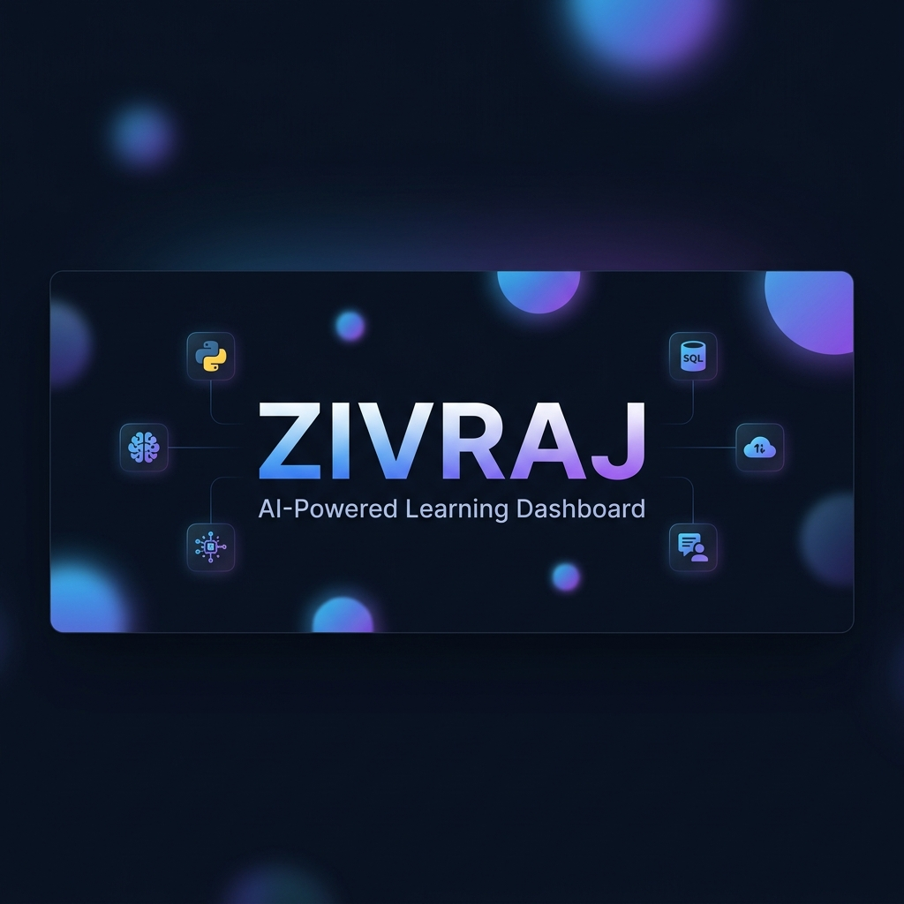
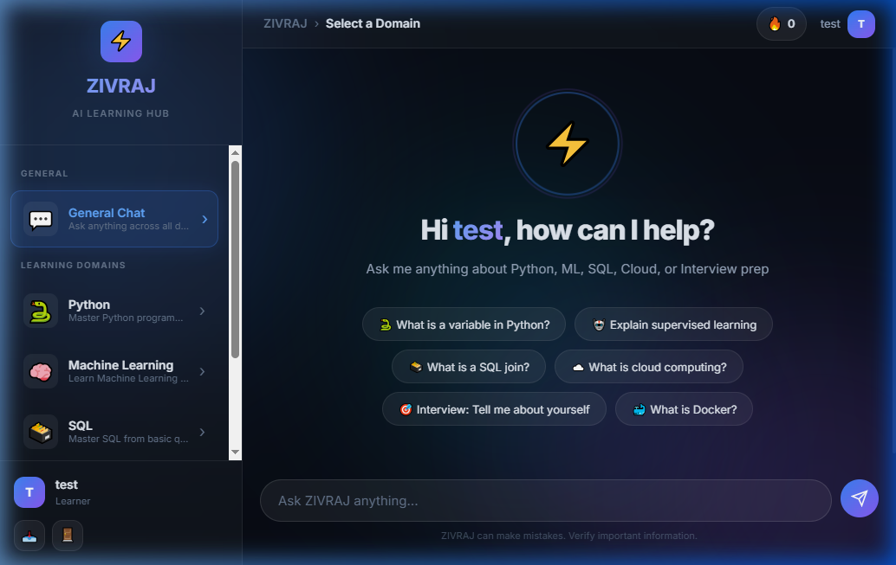
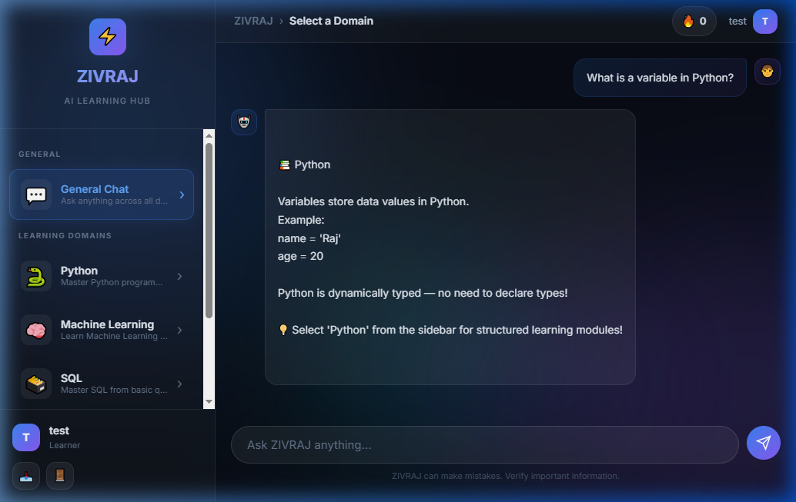
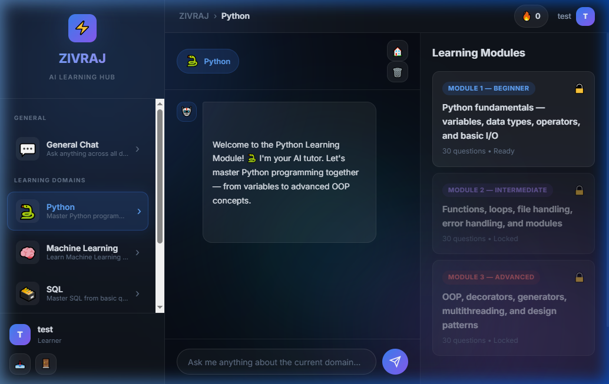

<p align="center">
  
</p>

<h1 align="center">⚡ ZIVRAJ — AI-Powered Learning Dashboard</h1>

<p align="center">
  <b>An intelligent, domain-based learning platform with ChatGPT-style conversational AI</b>
</p>

<p align="center">
  
  
  
  
  
</p>

---

## 🚀 Overview

**ZIVRAJ** is a modern AI-powered learning dashboard that combines a conversational chatbot with structured domain-based learning modules. Built with a sleek glassmorphism UI inspired by ChatGPT and Gemini, it offers an intuitive learning experience across multiple technology domains.

### ✨ Key Features

| Feature | Description |
|---------|-------------|
| 💬 **General Chat** | Ask anything — the AI searches across all domains to provide relevant answers |
| 📚 **5 Learning Domains** | Python, Machine Learning, SQL, Cloud Computing, Interview Guidance |
| 🎯 **Structured Modules** | Beginner → Intermediate → Advanced progression with unlock system |
| 📝 **MCQ Quizzes** | 300+ multiple-choice questions with instant feedback and explanations |
| ✍️ **Theory Practice** | Type your answers, then compare with the correct response |
| 🔥 **Streak Tracking** | Track consecutive correct answers to stay motivated |
| 🏆 **Leaderboard** | Compete with other learners on the global leaderboard |
| ⏱️ **Timed Sessions** | Track how fast you complete each module |
| 🏅 **Achievement Badges** | Earn badges for perfect scores and speed |

---

## 📸 Screenshots

### General Chat — ChatGPT-Style Landing
<p align="center">
  
</p>

### AI-Powered Responses Across All Domains
<p align="center">
  
</p>

### Domain-Specific Learning Modules
<p align="center">
  
</p>

---

## 🛠️ Tech Stack

| Layer | Technology |
|-------|-----------|
| **Backend** | Python 3.11+, Flask |
| **Database** | SQLite3 |
| **Frontend** | HTML5, CSS3 (Glassmorphism), Vanilla JavaScript |
| **Typography** | Inter, JetBrains Mono (Google Fonts) |
| **Design** | Futuristic Minimalism, Dark Mode, Glassmorphism |

---

## 📁 Project Structure

```
chatbot/
├── app.py                  # Flask application (routes, API, chatbot logic)
├── database.py             # Database initialization and schema
├── chatbot.db              # SQLite database (auto-created)
├── README.md               # This file
│
├── data/                   # Domain question banks (JSON)
│   ├── python_questions.json
│   ├── ml_questions.json
│   ├── sql_questions.json
│   ├── cloud_questions.json
│   └── interview_questions.json
│
├── templates/              # HTML templates
│   ├── login.html
│   ├── register.html
│   └── dashboard.html
│
├── static/                 # Static assets
│   ├── style.css           # Complete design system
│   ├── script.js           # Dashboard interactivity
│   └── images/             # Branding assets
│       ├── logo.png
│       ├── banner.png
│       └── screenshot_*.png
```

---

## ⚙️ Setup & Installation

### Prerequisites
- Python 3.11 or higher
- pip (Python package manager)

### 1. Clone the Repository
```bash
git clone https://github.com/yourusername/zivraj-chatbot.git
cd zivraj-chatbot
```

### 2. Install Dependencies
```bash
pip install flask
```

### 3. Run the Application
```bash
python app.py
```

### 4. Open in Browser
```
http://127.0.0.1:5000
```

---

## 📊 Learning Domains

| Domain | Modules | Total Questions | Topics |
|--------|:-------:|:---------------:|--------|
| 🐍 **Python** | 3 | 90 | Variables, OOP, Decorators, Generators |
| 🤖 **Machine Learning** | 3 | 90 | Supervised/Unsupervised, Neural Networks, Deep Learning |
| 🗃️ **SQL** | 3 | 90 | Queries, JOINs, Normalization, Indexing |
| ☁️ **Cloud Computing** | 3 | 90 | AWS, Docker, Kubernetes, CI/CD |
| 🎯 **Interview Guidance** | 3 | 90 | STAR Method, Behavioral, System Design |

---

## 🎨 Design Philosophy

ZIVRAJ follows a **Futuristic Minimalism** design language:

- **Glassmorphism** — Frosted glass effects with backdrop blur
- **Dark Mode First** — Easy on the eyes during long study sessions
- **Ambient Animations** — Floating gradient orbs and smooth transitions
- **Micro-interactions** — Hover effects, streak animations, and badge reveals
- **ChatGPT-Inspired** — Clean, centered chat interface for natural interaction

---

## 🤝 Contributing

Contributions are welcome! Feel free to:
1. Fork the repository
2. Create a feature branch (`git checkout -b feature/amazing-feature`)
3. Commit your changes (`git commit -m 'Add amazing feature'`)
4. Push to the branch (`git push origin feature/amazing-feature`)
5. Open a Pull Request

---

## 📄 License

This project is licensed under the MIT License. See the [LICENSE](LICENSE) file for details.

---

<p align="center">
  
  <br>
  <b>Built with ⚡ by ZIVRAJ</b>
  <br>
  <sub>AI-Powered Learning, Reimagined.</sub>
</p>
